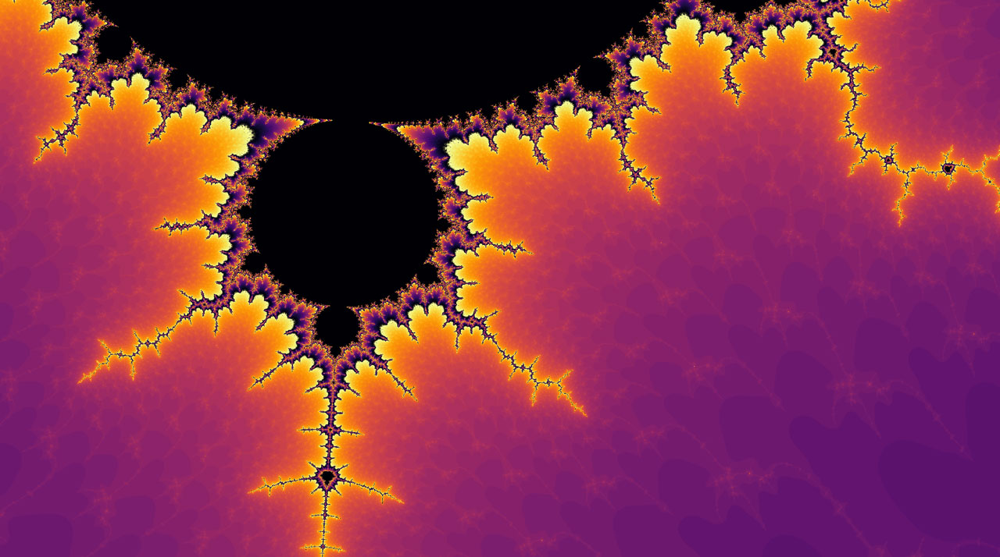

# Mandelbrot.jl

This is a library written in Julia to compute Mandelbrot fractals, using multi-threading and optionally GPU computing.


You can find more 4k images in the [images](images/) folder of this repository.

# Installation

Before you install this package, please download and install [ArrayFire](https://arrayfire.com/download/). Once you have rebooted your system you can continue with the installation.

Please clone/download this repository and than start Julia in the package folder, then type in the REPL:

```julia
using Pkg
Pkg.activate("./")
Pkg.instantiate()
using Mandelbrot
```

# Examples

## Computing a fractal

To create a fractal is as easy as this:

```julia
using Mandelbrot

cmap1 = Mandelbrot.cycle_cmap(:inferno, 5)        
xmin1 = -1.744453831814658538530        
xmax1 = -1.744449945239591698236        
ymin1 = 0.022017835126305555133        
ymax1 = 0.022020017997233506531 

fractal1_data = FractalData(
    xmin1,
    xmax1,
    ymin1,
    ymax1,
    width = Mandelbrot.w_4k,
    height = Mandelbrot.h_4k,
    colormap = cmap1,
    maxIter = 1500,
    scale_function = x -> x,
)

computeMandelbrot!(fractal1_data) 

display_fractal(fractal1_data, filename = "mandelbrot1.png")
```



## Interactive navigation

To find interesting coordinates, you can use the "interactive" navigator. To move you can use the functions `move_right`, `move_left`, `move_up`, `move_down` and you can zoom in or out using `zoom`:

```julia
cmap = Mandelbrot.cycle_cmap(:inferno, 5)
xmin = -2.2
xmax = 0.8
ymin = -1.2
ymax = 1.2

fractal0_data = FractalData(
    xmin,
    xmax,
    ymin,
    ymax,
    width = Mandelbrot.w_4k,
    height = Mandelbrot.h_4k,
    colormap = cmap,
    maxIter = 1500,
    scale_function = x -> x,
)

fractal0_data.maxIter = 50
preview_fractal(fractal0_data, scale = :linear)
Mandelbrot.move_center!(fractal0_data, -41, 0)

fractal0_data.maxIter = 500 #increas maximum number of iterations
Mandelbrot.zoom!(fractal0_data, 100)
Mandelbrot.move_left!(fractal0_data, 35)
Mandelbrot.zoom!(fractal0_data, 10)
Mandelbrot.move_left!(fractal0_data, 30, 0)
fractal0_data.maxIter = 1000
preview_fractal(fractal0_data, scale = x->1/log10(x)) #nice fractal!

coords = Mandelbrot.get_coords(fractal0_data) #let's save the coordinates for future use

Mandelbrot.set_coords(fractal0_data, coords...) #use this function if you want to quickly load some coordinates 

computeMandelbrot!(fractal0_data) # compute 4k resolution image
display_fractal(fractal0_data, scale = x->1/log10(x),
    filename = "images/mandelbrot_movement.png"
) #plot and save the fractal
```


## Animations

It is also possible to create an animation from a starting point (by default a zoomed out fractal) to an ending point in the following way:

```julia
xmin = 0.307567454839614329536
xmax = 0.307567454903142214608
ymin = 0.023304267108419154581
ymax = 0.023304267156089095573

Mandelbrot.create_animation((xmin, xmax, ymin, ymax), n_frames = 500, scale = log10, colormap = Mandelbrot.fire_and_ice())
```

You can see the resulting gif [here](https://github.com/aurelio-amerio/techytok-examples/blob/master/mandelbrot-fractal/gif/mandelbrot_into_the_eye1.gif) (33Mb).

# Progress

This is the first release of this library, much more work has to be done, currently I need to find a way to make smoother colormaps for the animations and implement correctly the perturbative theory computation schemes described at [Wikipedia](https://en.wikipedia.org/wiki/Mandelbrot_set#Perturbation_theory_and_series_approximation) and [mathr.co.uk](https://mathr.co.uk/blog/2016-03-06_simpler_series_approximation.html). Any help and contribution is appreciated!
